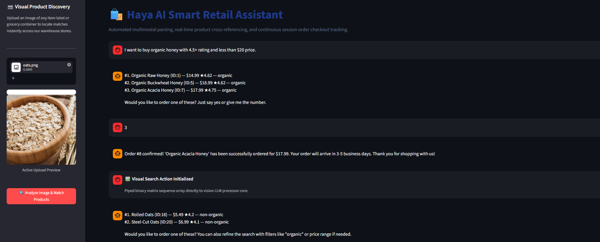

# 🛍️ Multimodal AI Shopping Agent

> **A production-grade single-agent system for end-to-end e-commerce workflows.**

Powered by **LangGraph**, **Groq**, and **multimodal LLMs**, this AI shopping agent handles natural language queries, product image analysis, database searches, ratings lookup, and secure transactional checkouts—all within a persistent conversational memory.

---

## ✨ Features

- 🔍 **Multimodal Vision**
  - Upload product images.
  - Vision LLM extracts structured attributes.
  - Performs intelligent product search.

- 🛒 **Intelligent Product Search**
  - Keyword search
  - Price filtering
  - Organic filtering
  - Rating filtering

- ⭐ **Real-Time Ratings**
  - Fetches customer reviews using a dedicated ratings API.

- ✅ **Secure Checkout**
  - Multi-turn confirmation before writing orders to the SQLite database.

- 🛡️ **Production Guardrails**
  - Budget constraints
  - Explicit user verification
  - Deterministic routing (low temperature)

- 💻 **Streamlit Dashboard**
  - Clean and responsive interface
  - Sidebar image upload
  - Persistent chat history

---

## 🏗️ System Architecture

The application uses a unified **ReAct (Reasoning + Action)** workflow orchestrated with **LangGraph**.

| Component | Description |
|-----------|-------------|
| **Multimodal Parsing Layer** | `llama-4-scout` (via Groq) analyzes uploaded images and returns structured product attributes. |
| **Reasoning Engine** | `qwen3-32b` (temperature = 0) performs deterministic tool routing and response generation. |
| **Tool Belt** | Custom LangChain tools for database search, ratings lookup, checkout, and vision. |
| **Persistence** | SQLite stores products, orders, and conversation memory. |

---

## 📷 Streamlit Dashboard

> Replace the image below with an actual screenshot of your application.

<p align="center">
  
</p>

---

## 📁 Repository Structure

```text
multimodal-ai-shopping-agent/
│
├── app.py                    # Streamlit frontend dashboard
├── shopping_agent.py         # Core LangGraph agent + tools
├── reviews_api.py            # Product ratings connector
├── shopping_agent.ipynb      # Prototyping & experimentation notebook
├── .env.example              # Environment variables template
├── requirements.txt
├── .gitignore
└── README.md
```

---

## 🛠️ Tech Stack

| Category | Technologies |
|----------|--------------|
| **Orchestration** | LangChain, LangGraph |
| **LLMs** | Groq (`qwen3-32b`, `llama-4-scout-17b-16e-instruct`) |
| **Frontend** | Streamlit |
| **Database** | SQLite3 |
| **Data Processing** | Pandas |
| **Utilities** | python-dotenv, Base64 image handling |

---

## 🚀 Quick Start

### 1️⃣ Clone the Repository

```bash
git clone https://github.com/MakramMuhammed/multimodal-ai-shopping-agent.git

cd multimodal-ai-shopping-agent
```

### 2️⃣ Install Dependencies

```bash
pip install -r requirements.txt
```

### 3️⃣ Configure Environment Variables

Copy the example environment file.

```bash
cp .env.example .env
```

Then add your Groq API key:

```env
GROQ_API_KEY=your_groq_api_key_here
```

---

### 4️⃣ Database Setup

Ensure the following files exist in the project root:

- `store.db`
  - SQLite database containing the **products** and **orders** tables.

- Product CSV
  - Can be generated from `store.xlsx` using the provided notebook.

---

### 5️⃣ Launch the Application

```bash
streamlit run app.py
```

Then open:

```
http://localhost:8501
```

---

## 🔧 Key Implementation Highlights

- Strict prompt engineering for consistent numbered product lists with IDs.
- Secure image handling using temporary files.
- Transaction safety with explicit checkout confirmation.
- Robust error handling and deterministic execution.

---

## 🎯 Skills Demonstrated

- Production-ready AI agents with LangGraph
- Multimodal tool-calling pipelines
- End-to-end AI system integration (UI + LLM + Database)
- Responsible AI practices and guardrails

---

## 🤝 Contributing

Contributions are welcome!

Feel free to open an issue or submit a pull request.

---

## 📄 License

This project is licensed under the **MIT License**.

---

<div align="center">

Made with ❤️ by **Makram Muhammed**

</div>